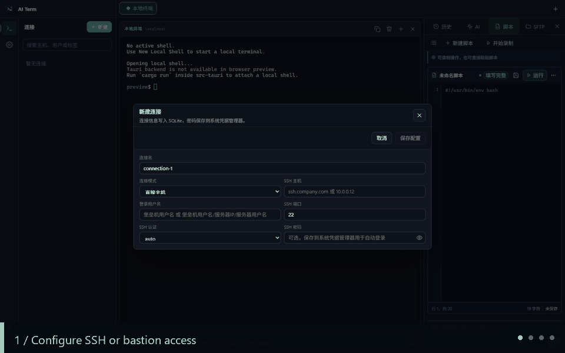
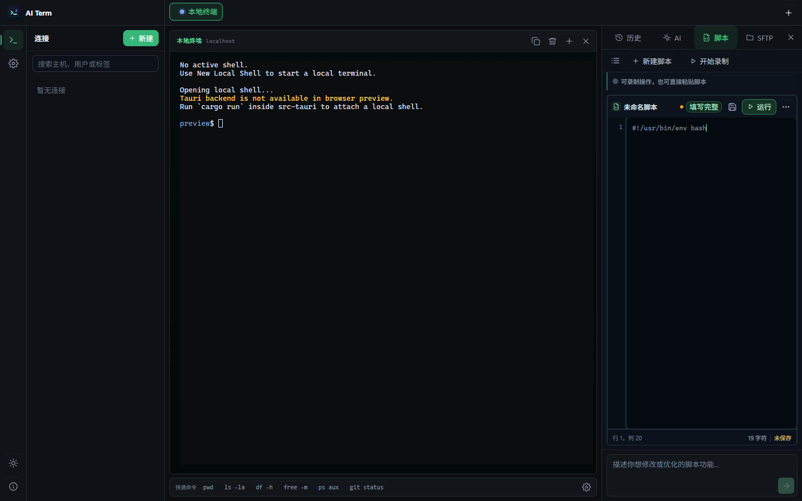
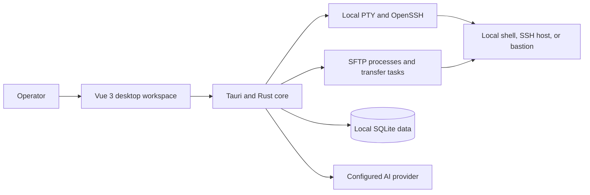

<p align='center'>
  
</p>

<h1 align='center'>AI Term</h1>

<p align='center'>
  A local-first AI terminal for SSH, bastions, SFTP, and repeatable server operations.
</p>

<p align='center'>
  <a href='https://github.com/tf1997/ai-term/releases/latest'>Download</a>
  · <a href='#product-tour'>Product tour</a>
  · <a href='#build-from-source'>Build from source</a>
  · <a href='#简体中文'>简体中文</a>
</p>

<p align='center'>
  <a href='https://github.com/tf1997/ai-term/releases/latest'></a>
  <a href='https://github.com/tf1997/ai-term/actions/workflows/release.yml'></a>
  <a href='LICENSE'></a>
  
</p>

<p align='center'>
  
</p>

AI Term puts the workflows around a real terminal into one desktop application: connect through direct SSH or a company bastion, inspect terminal context with an AI assistant, turn operations into reusable scripts, and move files through SFTP without switching tools.

The terminal remains the source of truth. AI suggestions are reviewable, risky commands require confirmation, and application data is stored locally in SQLite.

> AI Term is under active development. Validate SSH, SFTP, and AI-generated commands in a test environment before using them on production systems.

## Why AI Term

| Capability | What it changes |
| --- | --- |
| Bastion-first SSH | Handles direct hosts, gateways, and interactive jump-menu environments from the same connection model. |
| Context-aware AI | Uses selected output, terminal snapshots, and command history to answer questions grounded in the current session. |
| Operations to scripts | Records an operation window, drafts a reusable script, highlights readiness issues, and keeps execution guarded. |
| Terminal plus SFTP | Keeps shell work, remote browsing, uploads, downloads, progress, and cancellation in one workspace. |
| Local persistence | Stores connections, sessions, history, AI configuration, and scripts in a local SQLite database. |

## Product Tour

The guided tour above is captured from the real browser preview. It shows the same Vue interface used by the Tauri desktop application.

### A script workspace beside the terminal

<p align='center'>
  
</p>

Edit scripts with syntax highlighting, cursor and save state, readiness checks, AI-assisted revision, and risk-aware execution without losing sight of the active terminal.

## Core Workflows

### SSH terminal

- Open local shells or direct SSH sessions in tabs.
- Connect through bastions, gateway domains, and interactive jump menus.
- Type directly into the PTY, select to copy, and right-click to paste.
- Target one terminal or synchronize input across selected terminal tabs.
- Keep per-connection command history and workspace sessions.

### AI terminal assistant

- Use OpenAI-compatible endpoints, custom HTTP providers, or local Ollama-style services.
- Stream answers and stop generation at any time.
- Attach selected terminal text, recent output, and command history as context.
- Extract shell commands from Markdown and preview them before execution.
- Require confirmation for commands classified as dangerous.

### Script assistant

- Record commands and terminal output from an operation window.
- Generate or manually write Bash, PowerShell, CMD, and shell scripts.
- Detect unfinished values, TODO markers, and placeholders before execution.
- Highlight syntax, show risk categories, edit, rename, save, run, and delete scripts.
- Continue a focused AI conversation about the active script.

### SFTP workbench

- Browse local and remote directories side by side.
- Upload or download files and folders.
- Use direct SFTP or gateway-aware connection profiles.
- Track transfer speed, size, ETA, destination, and completion state.
- Cancel active tasks and use terminal fallbacks in constrained environments.

## Architecture



The frontend is Vue 3 and TypeScript. Tauri exposes the Rust backend for terminal processes, SSH/SFTP orchestration, persistence, and AI requests. xterm.js renders the terminal.

## Install a Release

Download the latest build from [GitHub Releases](https://github.com/tf1997/ai-term/releases/latest).

| Platform | Release asset |
| --- | --- |
| Windows x64 | `windows-x64-portable.zip` or `windows-x64-installer.msi` |
| Ubuntu amd64 | `ubuntu-amd64.deb` |
| macOS Intel and Apple Silicon | `macos-universal.dmg` |
| Alpine or other musl systems | `linux-x64-musl.tar.gz` |

The Linux musl package still depends on the GTK and WebKitGTK runtime libraries required by Tauri.

## Build From Source

### Requirements

- Node.js 20 or newer
- Rust stable
- Tauri 1 system dependencies for your operating system
- OpenSSH client tools available in `PATH`: `ssh` and `sftp`

### Run

```bash
git clone https://github.com/tf1997/ai-term.git
cd ai-term/frontend
npm install
npm run test:ui
npm run build

cd ../src-tauri
cargo run
```

AI Term currently loads `frontend/dist` from Tauri during development, so build the frontend before running the desktop shell.

For interface-only browser work:

```bash
cd frontend
npm run dev
```

The browser preview cannot provide real PTY, SSH, SFTP, SQLite, or Tauri IPC behavior. Verify those paths in the desktop application.

## AI Configuration and Data Boundaries

AI Term accepts an API root such as `https://provider.example/v1` or a full chat-completions endpoint. Configure the model, API key, context policy, and risk policy in the application.

Connection profiles, command history, conversations, and scripts are stored locally. Context selected for an AI request is sent to the provider you configure. Review that provider's retention and privacy policy before sending sensitive terminal output.

SSH passwords and AI API keys can currently be stored as plaintext for convenience. Protect the workstation with disk encryption and OS account controls. OS keychain-backed secret storage is planned.

## Verification

```bash
cd frontend
npm run test:ui
npm run build

cd ../src-tauri
cargo fmt --check
cargo check
cargo test
```

## Project Status

The current release is `v0.1.0`. The project is usable for evaluation and active development, with packaged builds for Windows, Ubuntu, macOS, and musl-based Linux.

Planned work includes stronger SSH key management, OS keychain integration, more transfer fallbacks for restricted bastions, and richer AI context controls.

## 简体中文

AI Term 是一个面向服务器运维场景的本地桌面工作台，把真实终端、SSH/堡垒机连接、SFTP 文件传输、AI 命令辅助和可复用脚本集中在同一个界面中。

- 支持本地终端、直连 SSH、堡垒机和交互式跳转菜单。
- AI 可结合当前终端输出、选中文本和命令历史回答问题。
- 可录制操作过程并生成脚本，在运行前检查占位符、未填写项和风险命令。
- 支持本地/远程目录浏览、上传下载、进度与取消任务。
- 会话、历史、配置和脚本默认保存在本地 SQLite 数据库。

推荐从 [Releases](https://github.com/tf1997/ai-term/releases/latest) 下载对应系统的安装包。AI 生成内容和高风险操作仍需人工确认，请先在测试环境验证。

## Contributing

Issues and focused pull requests are welcome. When reporting a terminal or transfer problem, include the operating system, connection mode, OpenSSH version, and a sanitized reproduction path.

If AI Term fits your workflow, star the repository and share which SSH, bastion, or SFTP workflow should be supported next.

## License

Licensed under the [Apache License 2.0](LICENSE).
