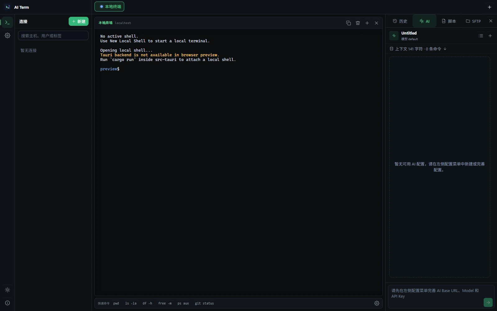
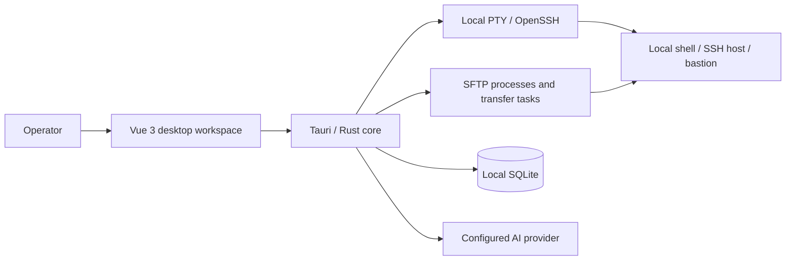

<p align="center">
  
</p>

<h1 align="center">AI Term</h1>

<p align="center">
  <strong>An AI-powered SSH workbench for real server operations</strong><br>
  Direct SSH, bastions, readable terminal output, AI assistance, script recording, and SFTP in one focused desktop app.
</p>

<p align="center">
  <a href="https://github.com/tf1997/ai-term/releases/latest">Download</a>
  · <a href="#why-ai-term">Why AI Term</a>
  · <a href="#product-tour">Product Tour</a>
  · <a href="#build-from-source">Build from Source</a>
</p>

<p align="center">
  <a href="https://github.com/tf1997/ai-term/releases/latest"></a>
  <a href="https://github.com/tf1997/ai-term/actions/workflows/release.yml"></a>
  <a href="LICENSE"></a>
  
</p>

<p align="center">
  
</p>

AI Term keeps a real terminal at the center of the workflow. AI reads only the context you choose, explains output, summarizes logs, drafts commands, and turns recorded operations into editable scripts. Commands, target servers, and risk remain visible, and execution stays under user control.

> AI Term is under active development. Validate SSH, SFTP, and AI-generated commands in a test environment before using them on production systems.

## Why AI Term

| Advantage | What it changes |
| --- | --- |
| **A focused SSH workbench** | Connections, terminal sessions, AI, scripts, and file transfers stay in one window while the terminal remains the primary surface. |
| **AI grounded in the current terminal** | Attach selected output, recent terminal snapshots, and command history to explain errors, summarize logs, and draft commands with real session context. |
| **Readable terminal output** | Preserve raw selectable output while adding clear connection state, command previews, risk warnings, and structured AI summaries. |
| **Operation recording + AI scripts** | Record commands and output, turn them into editable Bash, PowerShell, CMD, or shell scripts, then check placeholders and risk before execution. |
| **SFTP without switching tools** | Browse local and remote directories, transfer files, monitor speed and ETA, and cancel tasks from the same workspace. |
| **Built for bastion environments** | Manage direct SSH, bastions, gateway domains, and interactive jump menus through one connection model. |
| **Dark and light themes** | Switch the complete shell, terminal, AI, script, SFTP, and modal surfaces with one persisted preference. |

## Workspace At A Glance

<p align="center">
  
</p>

This dual-theme image is composed from the current Vue application in dark and light mode, so its layout stays aligned with the shipped interface.

## Product Tour

The animation above is captured from the current Vue browser preview and walks through the AI, script, and SFTP workspaces in both dark and light themes. Browser preview mode does not provide real PTY, SSH, SFTP, SQLite, or Tauri IPC behavior; verify those paths in the desktop application.

## Core Workflows

### SSH And Bastions

- Open local shells or remote SSH sessions in tabs.
- Connect to direct hosts, bastions, gateway domains, and interactive jump menus.
- Use password or SSH key authentication with separate gateway and target layers.
- Send input to one terminal or synchronize input across selected terminal tabs.
- Keep connection profiles, workspace sessions, and per-connection command history.

### AI Terminal Assistant

- Use OpenAI-compatible endpoints, custom HTTP providers, or local Ollama-style services.
- Attach selected terminal text, recent output, and command history on demand instead of sending full scrollback by default.
- Stream explanations, log summaries, and command drafts, and stop generation at any time.
- Extract shell commands from Markdown and preview them before inserting them into the terminal.
- Classify dangerous commands and require confirmation; AI does not bypass user execution.

### Script Recording + AI

- Record commands and terminal output from an operation window.
- Generate a script from recorded context, an empty draft, or an existing script.
- Edit with syntax highlighting, save state, script library, rename, copy, run, and delete actions.
- Detect TODOs, placeholders, unfinished values, and high-risk commands before execution.
- Continue a focused AI conversation about the active script without losing its context.

### SFTP Workbench

- Browse local and remote directories side by side.
- Upload or download files and directories with size, speed, progress, ETA, and destination details.
- Use direct SFTP or gateway-aware connection profiles.
- Cancel active tasks and retain terminal-based transfer fallbacks for restricted bastion environments.

### Dark / Light Theme

The theme switch in the left navigation updates the application shell, terminal palette, AI conversations, script editor, SFTP browser, and dialogs. The preference is stored locally and restored on the next launch.

## Architecture



The frontend uses Vue 3, TypeScript, and xterm.js. Tauri exposes the Rust backend to the interface, while Rust handles terminal processes, SSH/SFTP orchestration, persistence, and AI requests.

## Install A Release

Download the appropriate package from [GitHub Releases](https://github.com/tf1997/ai-term/releases/latest).

| Platform | Release asset |
| --- | --- |
| Windows x64 | `windows-x64-portable.zip` or `windows-x64-installer.msi` |
| Ubuntu amd64 | `ubuntu-amd64.deb` |
| macOS Intel / Apple Silicon | `macos-universal.dmg` |
| Alpine / other musl systems | `linux-x64-musl.tar.gz` |

The Linux musl package still requires the GTK and WebKitGTK runtime libraries used by Tauri.

## Build From Source

### Requirements

- Node.js 20 or newer
- Rust stable
- Tauri 1 system dependencies for your operating system
- OpenSSH client tools available in `PATH`: `ssh` and `sftp`

### Run

```bash
git clone https://github.com/tf1997/ai-term.git
cd ai-term/frontend
npm install
npm run test:ui
npm run build

cd ../src-tauri
cargo run
```

The desktop development flow currently loads `frontend/dist` from Tauri, so build the frontend before running the desktop shell.

For interface-only browser work:

```bash
cd frontend
npm run dev
```

## AI Configuration And Data Boundaries

AI Term accepts an API root such as `https://provider.example/v1` or a complete Chat Completions endpoint. You can configure the model, API key, context policy, and risk policy.

Connection profiles, command history, conversations, and scripts are stored locally. Only context explicitly selected and attached to an AI request is sent to the configured provider. Review that provider's retention and privacy policy before sending sensitive terminal output.

For convenience, the current version may still store SSH passwords and AI API keys in plaintext. Protect the workstation with disk encryption and operating system account controls; OS keychain integration is still being improved.

## Verification

```bash
cd frontend
npm run test:ui
npm run build

cd ../src-tauri
cargo fmt --check
cargo check
cargo test
```

## Project Status

The current release is `v0.1.0`. It is available for evaluation and active development, with packaged builds for Windows, Ubuntu, macOS, and musl-based Linux.

Planned work includes stronger SSH key management, OS keychain integration, more transfer fallbacks for restricted bastions, and richer AI context controls.

## Contributing

Issues and focused pull requests are welcome. When reporting a terminal or transfer problem, include the operating system, connection mode, OpenSSH version, and a sanitized reproduction path.

If AI Term fits your workflow, star the repository and share which SSH, bastion, or SFTP workflow should be supported next.

## License

Licensed under the [Apache License 2.0](LICENSE).
