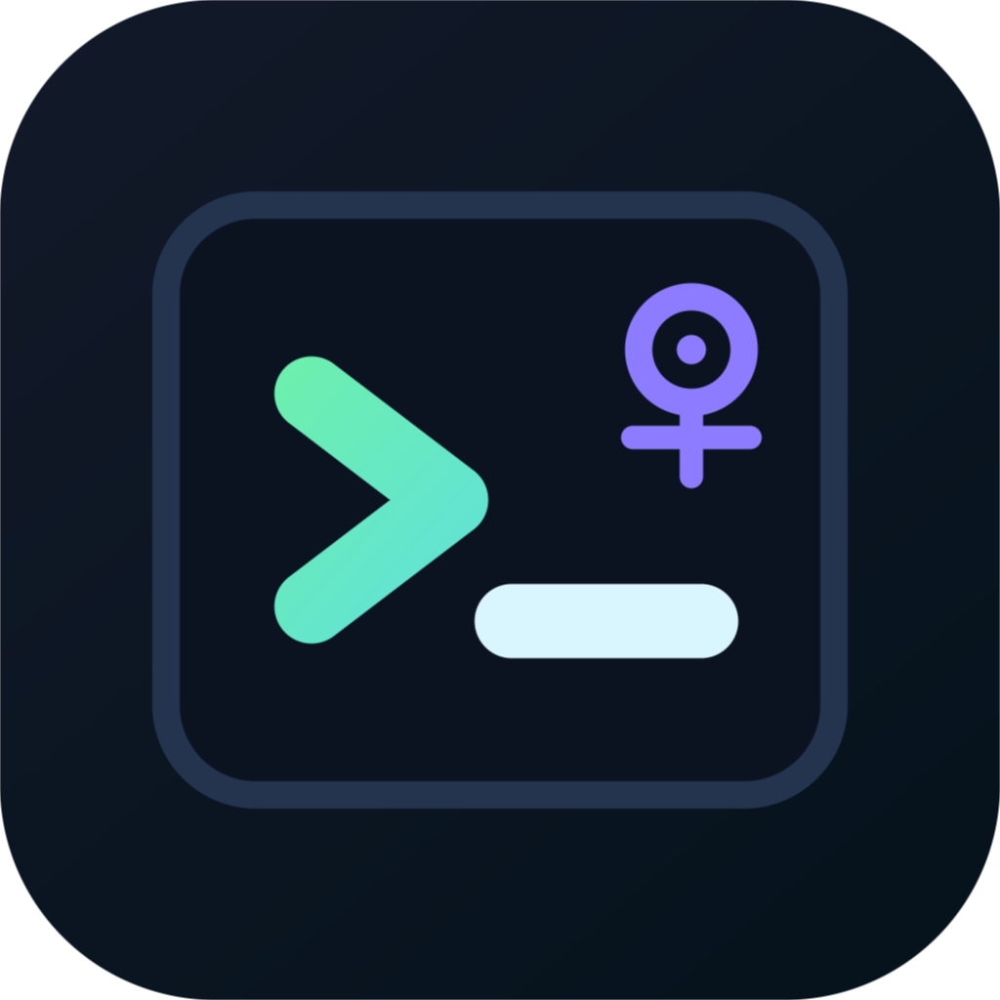

<p align="center">
  
</p>

<h1 align="center">AI Term</h1>

<p align="center">
  A desktop AI SSH/SFTP terminal for bastion-first server operations.
</p>

<p align="center">
  <a href="LICENSE"></a>
  
  
  
</p>

AI Term is a desktop client built with **Vue 3**, **Tauri 1**, and **Rust**. It combines a real terminal, SSH connection management, SFTP file transfer, AI-assisted command generation, and operation-to-script recording in one local app.

It is designed for teams that connect through company bastions, gateway domains, interactive jump menus, or direct SSH hosts.

> AI Term is under active development. Validate SSH, SFTP, and AI-generated commands in a test environment before using it on production servers.

## Highlights

| Area | What It Does |
| --- | --- |
| Terminal | Local shell, direct SSH, bastion/menu SSH, multi-tab sessions, direct keyboard input |
| SFTP | Direct SFTP, gateway SFTP, remote/local browsing, upload/download files and folders, cancellable tasks |
| AI Assistant | Streaming responses, stop generation, terminal context, command history, selected terminal text, shell command extraction |
| Script Assistant | Record an operation window, generate reusable update scripts, edit/save/run/delete scripts |
| Persistence | SQLite-backed connections, AI configs, sessions, command history, AI chat history, and scripts |

## Features

### SSH Terminal

- Local terminal as a built-in special connection.
- Direct SSH connection profiles.
- Bastion and interactive menu based connection flows.
- Multi-tab terminal workspace.
- Direct command input without a send button.
- Select-to-copy and right-click paste.
- Per-connection command history.

### SFTP Transfer

- Direct SFTP to a target server.
- SFTP through gateway / bastion style profiles.
- Remote directory browsing.
- Local home directory browsing.
- File and folder upload/download.
- Transfer task cancellation.
- Terminal fallback strategies for constrained environments.

### AI Terminal Assistant

- Multiple AI provider configurations.
- OpenAI-compatible APIs, custom gateways, Ollama-style local endpoints, and custom HTTP providers.
- Streaming model output.
- Stop response while the model is answering.
- Includes current terminal output, command history, and selected terminal text as context.
- Compresses large context before sending.
- Parses shell commands from fenced code blocks and natural language answers.
- Requires confirmation before running dangerous commands.
- Stores AI conversations per workspace session.

### Update Script Assistant

- Start and stop operation recording.
- Summarizes recorded commands and terminal output.
- Generates reusable update scripts with AI.
- Supports script editing before execution.
- Stores scripts per connection.
- AI-generated and manually editable script names.

## Tech Stack

| Layer | Technology |
| --- | --- |
| Frontend | Vue 3, TypeScript, Vite, xterm.js |
| Desktop Shell | Tauri 1 |
| Backend | Rust, Tokio, rusqlite, reqwest |
| Storage | SQLite |
| SSH/SFTP | OpenSSH-compatible `ssh` and `sftp` process integration |

## Project Structure

```text
.
├── frontend/          # Vue 3 frontend. All frontend files live here.
├── src-tauri/         # Tauri 1 + Rust backend.
│   └── src/
│       ├── app/       # Tauri commands, events, and application state.
│       └── domain/    # AI, connection, terminal, storage, and workspace domains.
├── docs/              # Design notes and preview documents.
├── LICENSE
└── README.md
```

## Requirements

- Node.js 20+
- Rust stable
- Tauri 1 system dependencies for your OS
- OpenSSH client tools available in `PATH`
  - `ssh`
  - `sftp`

macOS usually includes OpenSSH by default. On Linux or Windows, install the OpenSSH client package for your platform.

## Quick Start

Install frontend dependencies:

```bash
cd frontend
npm install
```

Build the frontend:

```bash
cd frontend
npm run build
```

Start the desktop client:

```bash
cd src-tauri
cargo run
```

AI Term currently loads `frontend/dist` from Tauri during development, so run `npm run build` before `cargo run`.

## Browser UI Preview

```bash
cd frontend
npm run dev
```

The browser preview is useful for UI work only. SSH, SFTP, local shell, SQLite, and Tauri IPC behavior must be verified in the desktop client.

## Verification

Frontend:

```bash
cd frontend
npm run test:ui
npm run build
```

Rust:

```bash
cd src-tauri
cargo fmt
cargo check
cargo test
```

## Configuration And Data

AI Term stores app data in SQLite under the Tauri application data directory. Stored data includes:

- SSH/SFTP connection profiles
- SSH passwords when plaintext saving is enabled
- AI provider configurations
- AI API keys when plaintext saving is enabled
- Workspace sessions
- Command history
- AI conversation history
- Update scripts

### Security Note

Plaintext SSH passwords and AI API keys are currently supported for convenience. Use workstation-level protections such as disk encryption, OS account protection, and restricted device access.

Future versions may add OS keychain-backed secret storage.

## AI Provider Notes

Most remote providers should expose an OpenAI-compatible chat completions API. The Base URL may be either:

- an API root, for example `https://example.com/v1`
- a full chat completions endpoint, for example `https://example.com/v1/chat/completions`

If a gateway returns an HTML login page instead of JSON or SSE, AI Term surfaces the provider error so the Base URL, certificate, network access, or authentication flow can be corrected.

## Safety

AI-generated commands and scripts should always be reviewed before execution. AI Term includes a dangerous-command confirmation layer, but it is not a replacement for operator judgment.

Be especially careful with commands involving:

- recursive delete operations
- disk formatting
- service restarts
- firewall changes
- Kubernetes deletes
- Docker prune
- broad ownership or permission changes

## Roadmap

- Stronger SSH key management and migration flows.
- OS keychain-backed secret storage.
- More transfer fallback strategies for restricted bastion environments.
- Richer AI context compression and per-session memory controls.
- Packaged release builds.

## License

AI Term is licensed under the [Apache License 2.0](LICENSE).
