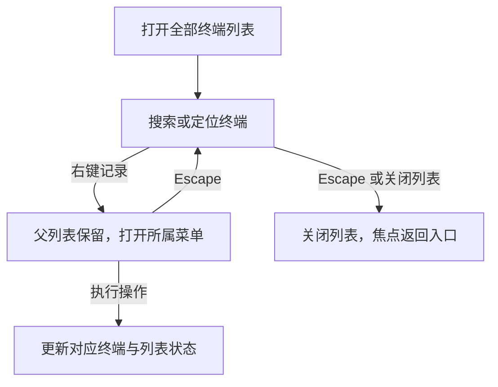

# AI Term 布局、浮层与 AI 脚本交互审查报告

- 日期：2026-09-15
- 代码基线：`5975174`
- 范围：主工作区、辅助工具、终端标签、全部终端列表、右键菜单，以及脚本库、脚本编辑器和脚本内 AI 修改流程。
- 输入：三组用户截图、用户对“全部终端小弹窗消失”的澄清、源码检查和独立浏览器复现。
- 状态：2026-09-16 已完成 F01–F19 的前端修复；原始分析保留，实施与验收记录见第 9 节。

## 1. 核心结论

当前界面的基本分区成立，主要问题集中在三个方面：**终端空间的优先级、浮层的事件与焦点归属、视图切换与任务生命周期的边界**。

1. “脚本”右侧的 X 仍有功能：它收起整个辅助区。其作用与上方“辅助工具”开关的收起方向重复，而且位置容易让人误以为只关闭脚本。建议移除这个 X，保留上方开关。
2. “全部终端”列表行右键后消失，原因已确认：代码先关闭列表弹窗，再打开右键菜单。上下文被主动移除了。
3. 终端右键菜单的不协调有具体实现原因：浅色主题把菜单项覆盖成描边按钮；深色风格的重阴影仍在；固定 320px 限高使八项短菜单也出现滚动条。
4. 比外观更需要优先处理的是键盘焦点：菜单展开后，方向键仍可能切换底层终端，菜单却留在原处。
5. 辅助区内部切换标签会销毁 AI、历史组件，而收起整个辅助区会保留它们。浏览器已确认切换标签丢失草稿和筛选；代码还显示卸载会触发 AI 请求及 Agent 的取消路径。
6. 前一轮发现的终端受挤压、历史区头部过高、按钮过密仍然成立；窄窗口直接隐藏连接与设置栏，需要作为功能问题处理。
7. 脚本区在窄栏同时出现风险和待填项时主动隐藏脚本名；拉宽后文件信息仍被旧样式裁切。返回脚本库后重开脚本、未保存草稿时再次新建，均已复现内容丢失。需要优先保证编辑对象和状态连续性。

终端启动后大片留白是正常状态。会话标签与“终端／文件”视图具有不同层级，保留两层导航也有依据。优化重点应落在空间分配和交互规则上。

## 2. 证据与判断边界

| 证据 | 本次用途 |
|---|---|
| 用户第一组截图：辅助区展开、收起 | 判断区域比例、历史区密度、边框和收起入口 |
| 用户第二组截图：全部终端列表、终端标签右键菜单 | 判断弹层视觉差异、菜单滚动和关闭入口 |
| 用户第三组截图：脚本编辑与 AI 输入、脚本库列表 | 判断脚本身份、编辑空间、状态提示、列表信息和 AI 修改流程 |
| 用户明确澄清 | “隐藏”指全部终端小弹窗消失 |
| 源码检查 | 确认事件顺序、状态归属、CSS 覆盖和响应式约束 |
| 独立无头 Chromium、Vite 页面预览 | 验证右键、焦点、键盘行为和浅色主题的实际计算样式 |

浏览器复现使用独立页面和隔离数据，不依赖用户现有窗口。菜单测量在 1280×820 CSS 像素视口进行，包含三个预览终端；另验证了 1100px、980px 宽度。草稿验证通过 Vue 开发组件状态注入仅存于内存的虚拟 AI 配置，使输入框正常启用，再实际输入文字；未发送请求，也未持久化配置。它验证的是前端行为；原生 WebView2、真实 SSH、实际 AI 请求的端到端表现不在本次运行验证范围内。不同截图的裁剪、缩放和系统标题栏会影响表面尺寸，不能直接把截图高度差判定为布局跳动。

下文使用三类证据标记：**运行确认**、**代码确认**、**设计建议**。优先级中，P1 表示影响操作正确性、状态保留或功能可达；P2 表示明显影响效率和理解；P3 表示视觉与偏好改善。

脚本补充验证使用独立预览存储构造四条样例，包含长名称、长代码行、摘要、待填项和风险文本。360px 辅栏在 1280×820 视口测量，560px 辅栏在 1440×820 视口通过现有调宽控件测量。仅展示和编辑样例，没有运行、保存脚本或发送 AI 请求；风险文本用于渲染状态。脚本 AI 异步回写问题来自代码检查，未以真实生成请求复现。

## 3. 问题清单

| 编号 | 优先级 | 问题 | 主要证据 |
|---|---|---|---|
| F01 | P2 | 列表行右键主动关闭父弹窗，丢失操作上下文 | 运行确认、代码确认 |
| F02 | P1 | 右键菜单没有接管键盘焦点，按键作用于底层终端标签 | 运行确认 |
| F03 | P1 | 切换辅助标签丢失草稿、筛选，并存在任务卸载取消路径 | 状态丢失运行确认；任务取消代码确认 |
| F04 | P2 | 辅助区 X 与上方开关重复，关闭对象表达模糊 | 代码确认、截图 |
| F05 | P2 | 通用右键菜单的样式、尺寸、状态和内容结构不统一 | 运行确认、代码确认 |
| F06 | P1 | 1040px 及以下连接、设置栏被直接隐藏，缺少替代展开方式 | 980px 运行确认、代码确认 |
| F07 | P2 | 两侧展开时终端横向空间不足 | 截图、代码确认 |
| F08 | P2 | CSS、鼠标、键盘使用不同宽度约束 | 代码确认 |
| F09 | P2 | 历史区头部过高，行内按钮持续争夺注意力 | 截图、代码确认 |
| F10 | P2／P3 | 调整空间的入口不明显，布局偏好记忆不完整 | 代码确认、设计建议 |
| F11 | P3 | 终端外围边框、间距和底部栏的容器层次偏多 | 截图、设计建议 |
| F12 | P2 | 脚本名在窄栏被隐藏，扩宽后信息区仍受旧样式限制 | 运行确认、代码确认 |
| F13 | P2 | 长代码依赖横向滚动，已有放大编辑入口不明显 | 运行确认、设计建议 |
| F14 | P2 | 脚本库辨识信息被截断，管理按钮的鼠标与键盘行为不同 | 运行确认、代码确认 |
| F15 | P2 | 待填、风险与运行禁用原因没有清楚区分 | 代码确认 |
| F16 | P1 | 返回脚本库、重新新建会丢失未保存脚本内容 | 运行确认、代码确认 |
| F17 | P1 | AI 修改结果未绑定原脚本 ID 和编辑版本 | 代码确认，异步覆盖风险 |
| F18 | P2 | AI 修改、应用结果、保存操作缺少统一对象表达 | 代码确认、设计建议 |
| F19 | P2 | 编辑区没有持续表达执行目标与解释器要求 | 代码确认、设计建议 |

### F01：列表右键关闭父弹窗

**复现：**打开“全部终端”，右键其中一条终端记录。列表弹窗消失，右键菜单出现。对“同步输入”列表中的记录做同样操作，也会关闭该弹窗。右键列表标题空白区域则未触发同一路径，浏览器复现中弹窗仍存在。

直接原因在 [TerminalTabsBar.vue](../frontend/src/domains/terminal/presentation/components/TerminalTabsBar.vue) 第 146–148 行：`openTabMenu()` 先调用 `closePopover()`，再发出 `contextMenu`。顶部标签、全部终端记录、同步记录共用此方法；弹窗通过 `v-if` 渲染，关闭会移除其 DOM。

影响包括：列表和搜索结果脱离视野，菜单失去来源锚点；菜单取消后不会返回原列表；重新打开列表还会清空搜索。多个同名终端时，这种上下文丢失更明显。

**建议：**列表内右键打开属于该列表的子菜单，保留列表、搜索和滚动位置。取消菜单后回到来源行。直接从顶部标签右键打开菜单时，无需建立列表父层。

不能只删除 `closePopover()`：菜单 Teleport 到 `body` 后，父弹窗的外部点击／`focusin` 检测仍可能将它当作外部；父弹窗在捕获阶段处理 Escape，也需要改成由最上层处理。应同时建立浮层归属关系、外部事件边界和焦点恢复规则。

### F02：菜单展开后，按键仍操作底层终端

**运行结果：**

- 从列表行右键打开菜单后，焦点落到 `BODY`；上下键没有进入菜单项，Escape 关闭后也没有回到来源列表。
- 从顶部终端标签右键打开菜单后，焦点仍在底层标签按钮。
- 此时按 `ArrowRight`，活动终端发生切换，右键菜单仍然显示。
- 按 Enter 可触发底层标签选择，而非菜单中的当前操作。

这使“屏幕上正在操作的菜单”与“实际接收按键的对象”不一致。活动终端变化后，菜单原先构建的目标和禁用状态也可能失去直观对应。

代码依据：[ContextMenu.vue](../frontend/src/shared/ui/ContextMenu.vue) 第 23 行起没有初始聚焦、方向键导航和焦点恢复；[useContextMenu.ts](../frontend/src/shared/ui/useContextMenu.ts) 第 24 行起只处理 Escape；[TerminalTabsBar.vue](../frontend/src/domains/terminal/presentation/components/TerminalTabsBar.vue) 第 127 行起仍处理标签方向键。

**建议：**打开菜单聚焦第一个可用项；上下键移动并跳过禁用项；Home／End 到首尾；Enter／Space 只执行聚焦项；Escape 只关闭最上层并恢复来源焦点。菜单存在时，底层标签导航不应响应这些按键。为菜单提供可访问名称，保留清晰的焦点样式。

### F03：切换标签与收起面板采用不同状态生命周期

辅助区外层通过 `v-show` 收起，所以收起／展开不销毁当前组件。但历史、AI 使用条件 `v-if`；脚本首次打开后使用 `v-show` 保留。见 [WorkspacePanel.vue](../frontend/src/app/ui/WorkspacePanel.vue) 第 86、125、133、178 行。

**运行确认：**

| 操作 | 实际结果 |
|---|---|
| 输入未发送 AI 草稿 → 收起／展开辅助工具 | 草稿保留 |
| 输入草稿 → 切历史 → 回 AI | 草稿清空 |
| 输入草稿 → 切脚本 → 回 AI | 草稿清空 |
| 历史选择“常用”、搜索 `pwd` → 收起／展开 | 视图和搜索保留 |
| 同样的历史状态 → 切 AI → 回历史 | 重置为“最近”和空搜索 |

由此产生三个问题：

- AI 输入 `askText` 是组件局部状态，切离 AI 后销毁，切回来重新初始化。见 [AiPanel.vue](../frontend/src/domains/ai/presentation/components/AiPanel.vue) 第 40、951 行。
- 历史“最近／常用”和搜索也是局部状态，切离历史再返回会重置。见 [CommandHistoryPanel.vue](../frontend/src/domains/terminal/presentation/components/CommandHistoryPanel.vue) 第 29–32 行。
- AI 卸载时调用当前请求的取消；Agent 卸载时调用准备取消及停止句柄。见 [useAiChat.ts](../frontend/src/domains/ai/application/useAiChat.ts) 第 221–225 行、[useAgentSession.ts](../frontend/src/domains/ai/application/useAgentSession.ts) 第 464–466 行。这里确认的是代码取消路径，没有发送真实请求来验证后端最终状态。

**建议：**把导航、显示状态和任务生命周期分开。草稿、筛选、滚动位置及进行中状态由稳定的组件或状态层持有；同一业务上下文内切换辅助工具只改变展示，请求停止使用明确的“停止”操作。跨终端、跨 AI 会话及关闭应用时的取消规则需单独处理。状态还需按 AI 会话／连接等业务对象绑定，不能仅将一个共享草稿机械地带到所有终端。

### F04：“脚本”旁 X 的功能重复与对象歧义

[WorkspacePanel.vue](../frontend/src/app/ui/WorkspacePanel.vue) 第 120 行的 X 发出 `close`；[AppShell.vue](../frontend/src/app/ui/AppShell.vue) 第 1066 行把 `rightCollapsed` 设为 `true`。上方“辅助工具”按钮在第 958–969 行切换同一个状态。

因此，应定性为“功能重复、对象表达模糊”。它没有删除脚本，也没有关闭终端。按钮靠近“脚本”标签，提示却叫“关闭工作区”，两者都没有准确表达“收起整个辅助区”。

**首选方案：**移除辅助区标签行右侧 X，保留上方“辅助工具”开关，增加清楚的视觉展开状态；现有 `aria-expanded` 继续准确表达状态。同步移除 `.workspace-bar` 为 X 预留的 30px 列，避免删除图标后留下空位。

若未来宽屏场景仍需要局部收起捷径，可使用侧栏收起图标，提示“收起辅助工具”，与上方开关共享状态。其他 X 应按实际对象逐一处理，见第 6 节。

### F05：右键菜单的不协调是多项规则叠加

**1. 浅色主题恢复了每个菜单项的描边与白底。**

[overlays.css](../frontend/src/app/styles/overlays.css) 第 714 行将菜单按钮设为透明背景和边框；后加载的 [theme-light.css](../frontend/src/app/styles/theme-light.css) 第 233 行用 `.theme-light button` 覆盖它。菜单后续规则主要修改文字色。运行时测得每行 32px 高，带 `1px solid` 边框和白色背景，因此呈现为一列独立按钮。

这个问题同时影响使用同一通用组件的终端、连接、AI 配置右键菜单，以及脚本编辑器的“更多操作”菜单。文件右键菜单有额外重置，外观反而不同。

**2. 短菜单被固定限高挤出滚动条。**

浅色终端菜单实测外框 **220×320px**，`scrollHeight=329`、`clientHeight=318`。八个短操作项加标题、间距和内边距，已超过 [overlays.css](../frontend/src/app/styles/overlays.css) 第 693 行的 320px 上限。

此外，[useContextMenu.ts](../frontend/src/shared/ui/useContextMenu.ts) 第 10–14 行用固定宽度和每项 38px 估计定位高度，与实际 CSS 分开维护。建议按实际渲染尺寸和视口可用空间定位；短菜单自然展开，空间确实不足时才滚动。“全部终端”属于可增长列表，应保留列表滚动，两者不共用固定限高。

**3. 阴影明显重于其他小弹层。**

| 弹层 | 当前阴影 | 圆角 |
|---|---|---:|
| 通用右键菜单 | `0 18px 48px rgba(0,0,0,.48)` | 8px |
| 全部终端弹窗 | `0 12px 36px rgba(0,0,0,.2)` | 10px |
| 文件／路径弹层 | `0 8px 28px #0003` | 7px |

前两项已读取运行时样式，第三项来自 [file-workspace.css](../frontend/src/domains/transfer/presentation/styles/file-workspace.css) 第 602 行。浅色菜单的大块暗影强化了“悬浮小窗口”的感觉，与主页面克制的分隔线不协调。

**4. 操作内容没有按对象和状态收敛。**

单终端状态固定显示八项，其中六项禁用；“切换到此终端”对当前终端也没有新的操作结果。同步控制、创建、关闭混排，三个关闭项连续突出。多个同名终端在标签和列表里有序号，菜单标题却直接使用 `tab.title`，缺少同样的身份区分。

菜单动作已正确绑定被右键终端的 ID；需要补齐的是身份显示与焦点边界。

建议将对象相关操作保留在菜单，把“当前终端始终接收输入”作为说明；全局同步设置主要放在现有同步入口。为常用操作、同步操作、关闭操作分组；按状态减少不适用的条目。对于需要保持可发现性的禁用项，说明原因。菜单标题复用终端显示名称和序号。

**5. 禁用和危险状态也不一致。**

通用菜单的 `:hover` 没有排除 `:disabled`，禁用项仍可能出现底色和描边反馈；文件菜单的通用 hover 文字色又可能覆盖危险项的红色。依据为 [overlays.css](../frontend/src/app/styles/overlays.css) 第 724–733 行、[theme-light.css](../frontend/src/app/styles/theme-light.css) 第 935–946 行、[sftp.css](../frontend/src/domains/transfer/presentation/styles/sftp.css) 第 371–379 行。

**建议：**菜单项使用独立样式，默认平铺；hover／focus 表达整行选中；禁用项不产生可点击反馈；危险项在 hover 后仍保持其语义色。主题通过菜单变量换色，避免再次叠加通用按钮覆盖。

### F06：窄窗口直接隐藏连接与设置功能

[responsive.css](../frontend/src/app/styles/responsive.css) 第 20–36 行在宽度 ≤1040px 时，将左侧内容列设为 0，并无条件设置 `.sidebar { visibility: hidden }`。点击连接／设置图标虽然更新展开状态，却没有抽屉或浮层承接内容。

桌面最小宽度为 980px，见 [tauri.conf.json](../src-tauri/tauri.conf.json) 第 50 行，因此这是桌面可达到的状态。建议在空间不足时切换为可展开的抽屉，保留同一导航入口、可见的关闭动作和键盘返回路径。

**运行确认：**980px 下连接列为 0px，侧栏本体宽度为 0–1px、`visibility:hidden`。连续两次点击连接图标、再点击设置图标，都不能显示侧栏内容。

应以终端剩余空间决定布局变换，而非先持续挤压终端、到某个断点再把侧栏内容直接隐藏。820px 以下的规则不是正常桌面最小尺寸内的主要验收对象。

### F07：两侧常驻时终端占比不足

用户原始截图约为 1280px 宽，可近似拆分如下：

| 区域 | 辅助区展开 | 辅助区收起 |
|---|---:|---:|
| 导航＋连接栏 | 48＋224＝272px | 272px |
| 中央布局列 | 648px | 1008px |
| 终端可视框，扣除外围间距后 | 约 632px | 约 992px |
| 右侧辅助区 | 360px | 0 |

终端可视框收窄约 36%。对长命令、日志和宽表格的影响，远大于启动画面能体现的程度。代码在该断点允许右栏达到 390px，中央列还会进一步缩小。

建议历史面板提供约 300–320px 的紧凑档，AI／脚本保留适合其内容的宽度。终端最低宽度结合实际字体单元宽度和目标字符列数制定；空间不足时切换侧栏布局。保留用户主动调宽的能力，不在每次切换工具时突然改变终端列数。

### F08：宽度的显示与调整规则不同步

布局约束分散在 [workspace-polish.css](../frontend/src/app/styles/workspace-polish.css) 第 3–5 行、[responsive.css](../frontend/src/app/styles/responsive.css) 第 1–4 行，以及 [workspaceLayout.ts](../frontend/src/domains/settings/domain/workspaceLayout.ts)。

- 1280px 及以下，CSS 把右栏限制到最多 390px，键盘算法仍可将存储值设到 560px。继续按缩小键，可能多次看不到宽度变化。
- 鼠标算法假定展开的左侧总宽为 296px，该断点实际是 272px。
- 代码中的 560px 终端保护只用于鼠标调整，不统一约束窗口缩放和键盘调整；右栏最小 360px 又可能覆盖这个保护意图。
- 1100px 下两侧展开时，中央布局列仅约 438–468px，直到 1040px 才进入另一种布局。

本次在右栏 360px 时运行测得：1100px 窗口网格为 `48 / 224 / 468 / 360px`，终端可视框宽度仅 452px。

建议统一计算当前有效宽度和可调整范围，供 CSS、分隔条、鼠标、键盘和可访问属性共同使用。用户偏好宽度可以单独保存，但键盘下一步应以当前可见宽度为起点。

### F09：历史区的控制密度超过内容需要

右栏从“历史／AI／脚本”到第一条记录之前约占 180px，包括面板标题、连接信息、计数、筛选和搜索。未筛选时，“已加载 37 条”与“37／37”重复提供计数。

每行另有复制、固定、填入三个常驻按钮；长命令还增加预览按钮。这同时增加视觉噪声并压缩命令文本宽度。代码依据：[CommandHistoryPanel.vue](../frontend/src/domains/terminal/presentation/components/CommandHistoryPanel.vue) 第 230–316 行、[theme-shell.css](../frontend/src/app/styles/theme-shell.css) 第 5–15、104–166 行。

建议将标题／连接／计数合并到更紧凑的控制区，筛选和搜索集中布置，头部可先以约 120–140px 作为方案评估目标。计数保留一个位置，搜索后明确显示“匹配／总数”。行内保留“填入终端”主要动作，复制和固定在悬停或键盘聚焦时显现；触屏或无 hover 环境保留可发现入口。动作显现时不改变行宽，不造成命令文本跳动。

“填入终端”当前不等于执行命令，精简布局时应保留该语义。

### F10：空间控制的发现性与偏好记忆

左右栏已经可以收起，右栏已经可以鼠标、键盘调宽并保存宽度。需要改善的是入口与反馈：左栏收起依附于终端图标；右栏分隔条命中区为 6px，常态几乎不可见。见 [AppShell.vue](../frontend/src/app/ui/AppShell.vue) 第 214 行、[workspace-polish.css](../frontend/src/app/styles/workspace-polish.css) 第 579–600 行。

可以在连接栏标题附近提供更明确的收起动作，增强分隔条 hover／focus 提示。增加入口时与既有导航行为保持同一状态源。

另一方面，左右栏显示状态、当前辅助标签每次挂载都回到默认值，而宽度会持久化。见 [AppShell.vue](../frontend/src/app/ui/AppShell.vue) 第 51–53 行、[WorkspacePanel.vue](../frontend/src/app/ui/WorkspacePanel.vue) 第 75 行和 [settingsStorage.ts](../frontend/src/domains/settings/infrastructure/storage/settingsStorage.ts) 第 84–93 行。实际辅助标签由子组件持有，父组件另有记录；恢复偏好需要统一实际状态源，不能只保存父组件的镜像。建议记忆最近布局偏好；这是体验改善，不将当前“没有记忆”定性为功能故障。

### F11：终端外围容器可以更连续

终端主区背景、外围间距、圆角描边框，以及底部单独描边的固定命令栏形成多层包裹。辅助区则更接近平铺列表，两者视觉节奏不同。

建议减少一层终端外围描边，让固定命令栏通过细分隔线与终端衔接。统一外边距，保留输出与窗口边缘之间必要的阅读空间。此项属于视觉调整，优先级低于焦点、状态和窄窗口问题。

## 4. AI 脚本区专项分析

这组截图呈现两个任务：脚本库帮助用户找到脚本，编辑页帮助用户理解、修改、保存并运行当前脚本。当前有限宽度优先展示了状态和管理按钮，脚本身份、用途及操作结果却不够清楚。

已有代码高亮、行号、未保存标记、待填项点击定位、风险确认，以及可编辑的放大预览。脚本面板在切换其他辅助标签时也会保留实例。下面区分入口表达不足与实际状态缺陷。

### F12：脚本名称被隐藏，扩宽后仍有信息裁切

编辑工具栏同一行容纳脚本图标、名称、未保存圆点、待填状态、风险标签、保存、运行和更多操作。状态标签禁止收缩，右侧按钮区也有内容最小宽度。

[workbench-final.css](../frontend/src/domains/scripts/presentation/styles/workbench-final.css) 第 384–398 行规定：容器宽度 ≤430px，且同时存在风险和待填项时，将 `.script-file-tab strong` 设为 `display:none`。浏览器确认名称文本仍存在，但尺寸为 `0×0`。用户截图中名称消失符合该条件。

对脚本库详情编辑器，还有一层问题：[workbench.css](../frontend/src/domains/scripts/presentation/styles/workbench.css) 第 750–751 行的 `.script-library-editor .script-file-tab { max-width:180px }` 优先级高于后续单类重置。即使辅栏扩到 560px，文件信息容器仍只有 180px，`scrollWidth` 实测 265px；名称仅分到 72px，风险提示被裁切，工具栏中间却留有空白。这个 180px 限宽选择器不适用于新建草稿编辑器。

**建议：**清理冲突的尺寸规则，让文件信息真正使用可用空间。窄栏始终保留脚本名，可省略但应能查看全名；将待填和风险放到按需出现的状态行。保存、运行和放大入口保持稳定。底部字符数等次要信息应优先让位，不能以隐藏编辑对象名称换取紧凑。

### F13：长代码的主要限制是横向空间

脚本库详情编辑器的浏览器对比结果如下。560px 对照使用更宽的应用窗口，避免受到 1280px 窗口的右栏 390px 上限影响。

| 实测项目 | 360px 辅栏 | 560px 辅栏 |
|---|---:|---:|
| 编辑工具栏宽度 | 341px | 541px |
| 文件信息容器 | 180px | 180px |
| 保存／运行／更多按钮区 | 120px | 120px |
| 代码输入框宽度 | 305px | 505px |
| 扣除文本内边距后的代码宽度 | 271px | 471px |

样例长行的横向内容宽度为 1908px。水平滚动和高亮层同步均有效，不能报告成代码内容丢失；但核对长变量声明或命令首尾需要频繁横向移动。

编辑器明确采用 `wrap="off"`、`white-space:pre`，见 [ScriptPanel.vue](../frontend/src/domains/scripts/presentation/components/ScriptPanel.vue) 第 1153、1235 行及 [editor.css](../frontend/src/domains/scripts/presentation/styles/editor.css) 第 134–169 行。高度在用户截图中仍有较多代码行，首要瓶颈是宽度。

**放大能力已经存在：**“更多操作 → 放大预览”支持编辑、保存、运行。本次窗口实测为 960×760px，代码输入区宽 910px，完整长名称可见。见 [ScriptPanel.vue](../frontend/src/domains/scripts/presentation/components/ScriptPanel.vue) 第 140–151、942–985 行。

**建议：**将“放大编辑”提升为明确入口，名称反映可编辑性。侧栏用于快速查看和小修改，长脚本利用已有的大编辑视图。若提供软换行，应一起处理行号、高亮、光标和滚动，不能只修改一条 CSS，也不宜继续缩小代码字号。

### F14：脚本库的辨识信息、管理动作和键盘行为不协调

**信息被截断。**360px 辅栏中每行高 50px，文本区域宽 267px，两个管理按钮各 28px。测试长名称需要 361px，摘要连来源需要 624px，均被单行省略，名称和摘要没有完整文本提示。来源被拼在摘要尾部，容易一起消失；有摘要时不显示更新时间，无摘要时直接展示时间字符串。见 [ScriptPanel.vue](../frontend/src/domains/scripts/presentation/components/ScriptPanel.vue) 第 1095–1097 行。

用户截图中多条“执行前确认…”摘要占用了最先被看到的位置，却没有帮助区分脚本用途。这是这些记录的内容问题，不能推广为所有脚本都采用同一摘要。

**铅笔只负责重命名。**鼠标点击铅笔会打开“编辑脚本名称”，整行点击才进入内容编辑器。顶栏列表图标则是返回脚本库的现有入口。可见表达不足，但这些功能并未缺失。

**键盘操作确实不同。**聚焦铅笔后按 Enter，运行复现中进入了脚本内容详情，没有打开重命名对话框，焦点落到 `BODY`。父行的 `@keydown.enter.prevent` 接收了子按钮冒泡的按键。行本身 Space 无效，Enter 能打开，但没有把焦点交给编辑器。见 [ScriptPanel.vue](../frontend/src/domains/scripts/presentation/components/ScriptPanel.vue) 第 1088–1100 行。

**底部灰色来自容器背景。**[theme-light.css](../frontend/src/app/styles/theme-light.css) 第 432–434 行把列表背景设为 `--light-border`。四条记录之后露出大片分隔线颜色，像占位层；留白本身正常，不应拉高记录或填入装饰。

**建议：**名称优先，摘要用一句话说明用途；来源、解释器或更新时间作为短元信息展示。将重命名、删除合并到稳定的“更多”入口，或在 hover／focus 时显现。详情页明确显示“返回脚本库”。父行导航和内部管理按钮使用独立键盘事件，鼠标与 Enter／Space 执行同一语义。已有选中态保留，并增强其与 hover 的区别；列表背景使用面板色，分隔线单独绘制。

### F15：待填、风险与运行禁用原因需要分开解释

截图同时出现“待填 1 · 6行”“发现高风险”和灰化运行按钮，容易让用户把不能运行归因于风险检查。

实际上 `canExecute*` 根据内容是否非空、是否有待填项决定可用性。高风险本身不直接禁用运行，而是在运行时进入确认。依据：[ScriptPanel.vue](../frontend/src/domains/scripts/presentation/components/ScriptPanel.vue) 第 134–136 行、[useScriptExecution.ts](../frontend/src/domains/scripts/application/useScriptExecution.ts) 第 139–167 行。运行按钮提示却主要依据风险等级，没有准确解释当前禁用原因。

待填徽标已经可以逐项定位并选中相应行，见 [ScriptPanel.vue](../frontend/src/domains/scripts/presentation/components/ScriptPanel.vue) 第 354–390 行；风险标签主要通过 `title` 提供说明。相似的小徽标外观没有清楚表达不同的可操作性。

**建议：**文案改为“待填 1 项 · 第 6 行”，以“查看并补全”表达已有定位动作；运行不可用时就近显示“补全 1 项后可运行”。风险另表达为“运行前需确认”，提供可主动打开的说明。保留已有检查能力，修正状态、原因和下一步动作的对应关系。

### F16：未保存提示存在，但返回和新建会丢失内容

以下两条路径已经浏览器复现，均未出现确认提示：

| 操作 | 实际结果 |
|---|---|
| 在脚本 A 加入未保存标识 → 返回脚本库 → 再打开 A | 恢复保存版本，标识丢失，未保存状态消失 |
| 新建草稿并输入内容 → 再次点击新建脚本 | 草稿直接清空 |

[ScriptPanel.vue](../frontend/src/domains/scripts/presentation/components/ScriptPanel.vue) 第 214–216 行的 `loadSelectedScript()` 每次从保存版本重置编辑内容；第 811–821 行新建动作直接清空草稿。已有确认只覆盖第 596 行的“清空编辑器”。

另一个代码边界是：清空已保存脚本的全部内容后，`selectedScriptDirty` 因内容为空提前返回 `false`，变化提示也会消失，见同文件第 127–129 行。此空内容边界来自代码检查，本次没有额外运行验证。

**建议：**按脚本 ID 保留草稿，普通返回列表不丢失修改。新建可以创建独立草稿对象；确需丢弃时提供“保存／丢弃／取消”。未保存状态按与保存版本的差异判断，空内容也是修改；保存是否允许空脚本另行约束。

这与 F03 的 AI 标签卸载不同：脚本面板在切换历史／AI 辅助标签时已经保留；这里的问题发生在脚本内部的选取和新建流程。

### F17：AI 修改结果没有绑定原脚本和编辑版本

从脚本 A 发起 AI 修改后，用户仍能打开脚本库、选择 B 或新建。请求返回时，[useScriptGeneration.ts](../frontend/src/domains/scripts/application/useScriptGeneration.ts) 第 128–140 行仅根据 `target === 'selected'` 更新当前编辑草稿，没有校验原脚本 ID 或发起时的内容版本。

因此存在两条代码路径风险：A 的修改结果写入后来选中的 B 的草稿；用户等待期间的手工修改被返回结果覆盖。请求 ID、取消状态检查不能替代脚本和内容版本检查。本次没有发送生成请求，这项应表述为代码确认的覆盖风险，不能称为已在线复现的事故。

**建议：**请求绑定脚本 ID、草稿版本和业务上下文，界面显示“正在修改〈脚本名〉”。结果只关联原对象；对象已切换或内容已继续编辑时，保留为待采纳版本，提供差异查看和应用动作。对象归属应由状态模型保证。

### F18：AI 输入、应用结果和保存缺少连贯的对象表达

**输入对象依赖占位符。**“描述你想修改或优化的脚本功能…”说明了用途，但输入后文字消失，再遇到 F12 的名称隐藏，用户难以持续确认修改对象。建议以轻量上下文行显示脚本名；模型信息在需要切换或解释不可用原因时可访问，无需复制整个 AI 聊天工具栏。

**基础输入体验已有分叉。**脚本实际使用 `unified-ai-compose script-ai-compose`、右箭头发送、29px 按钮、固定两行输入和最大高度约束；AI 标签使用 `chat-composer`、向上箭头和自动增高。当前脚本输入框实测约 80px 高，未配置时禁用，配置后可输入。

依据：[ScriptPanel.vue](../frontend/src/domains/scripts/presentation/components/ScriptPanel.vue) 第 1350–1370 行、[composer.css](../frontend/src/domains/ai/presentation/styles/composer.css) 第 2–50 行、[AiPanel.vue](../frontend/src/domains/ai/presentation/components/AiPanel.vue) 第 399、666 行。建议统一边框、留距、发送／停止图标和多行增长行为。旧 `.script-compose` 样式的注释不能证明当前两个界面已经统一。

**生成、应用、保存需要分别反馈。**当前已有等待提示、计时和停止按钮；缺的是正在处理的对象，以及结果应用和保存到什么位置。

| 当前入口 | 实际含义 | 建议表达 |
|---|---|---|
| 已保存脚本的编辑器保存 | 更新该脚本 | 保存修改 |
| 新建草稿的编辑器保存 | 首次创建记录；已有草稿关联记录后更新该记录 | 首次保存脚本，后续保存修改，并显示名称 |
| AI 回复中的保存 | 首次保存可能创建另一条脚本记录 | 保存为新脚本；已有记录时明确对象 |
| AI 回复中的设为草稿 | 更新通用草稿，不一定切换到该草稿视图 | 明确应用目标，展示应用后的编辑器 |
| AI 修改返回 | 可自动写入编辑草稿 | 标记已应用／待采纳，与已保存区分 |

依据：[ScriptPanel.vue](../frontend/src/domains/scripts/presentation/components/ScriptPanel.vue) 第 393–427、482–506、575–587 行。首次保存草稿或消息还可能先等待 AI 命名，再进入“保存中”；建议从点击开始反馈处理状态。成功反馈突出脚本名和查看入口，替换当前面向用户的 SQLite／localStorage 存储说明。

### F19：运行附近需要说明目标与解释器

当前已有来源信息，以及跨连接／风险确认中的目标提示。主要编辑区运行按钮附近却没有持续表达目标；底部只有通用 `Shell · UTF-8 · LF`，窄栏还隐藏这一项。

生成提示偏向 Bash，执行入口最终构造 Bash 包装输入，见 [useScriptGeneration.ts](../frontend/src/domains/scripts/application/useScriptGeneration.ts) 第 278 行、[useScriptExecution.ts](../frontend/src/domains/scripts/application/useScriptExecution.ts) 第 170–188 行、[scriptExecution.ts](../frontend/src/domains/scripts/domain/scriptExecution.ts) 第 28–35 行。列表里的“Windows 诊断”名称不能代替对脚本解释器和当前 Shell 的说明。本次未在真实 Windows Shell 运行脚本，不据此宣称已复现兼容性失败。

**建议：**在运行区域就近显示“本地终端／连接名／同步 N 个”等实际目标，表达 Bash 等运行要求。目标变化时更新提示，已知不兼容时给出可执行的处理路径。持续区分“已发送到终端”和“执行成功”，后者需要完成结果依据。

### 建议的脚本页面结构

| 区域 | 优先呈现的内容 |
|---|---|
| 脚本库 | 名称、用途、少量来源信息；管理动作退居次要位置 |
| 编辑页顶部 | 返回脚本库、当前脚本名、未保存状态、明确的放大编辑入口 |
| 编辑页操作区 | 保存修改、运行；执行目标和解释器就近可见 |
| 条件状态行 | 待填项及定位动作、需确认的风险；按状态出现 |
| 编辑器主体 | 稳定行号、高亮、光标和滚动；长代码进入大编辑视图 |
| AI 修改区 | 当前修改对象、需求输入、生成／停止、待采纳结果和应用状态 |

推荐流程为“找到脚本 → 明确编辑对象 → 手工或 AI 修改 → 核对变化 → 保存 → 对目标运行”。它需要由界面信息和状态保留共同支撑。

## 5. 同类组件的横向检查

| 表面 | 已有行为／差异 | 统一方向 |
|---|---|---|
| 终端、连接、AI 配置右键菜单及脚本更多菜单 | 共用 `ContextMenu`；共享按钮覆盖和焦点缺口，定位调用各自核对 | 统一修复共享组件，再验证各业务菜单内容 |
| 文件右键菜单 | 已有首项聚焦、方向键；执行操作或 Escape 后返回文件视图；有独立样式重置 | 保留已有能力，抽出可复用协议，核对危险状态颜色 |
| 全部终端／同步列表 | 搜索初始聚焦、方向键、外部事件关闭；列表行右键卸载父层 | 保留列表用途，补齐子菜单归属和分层退出 |
| 路径弹窗 | 透明遮罩、Tab 焦点限制，与终端列表的非模态行为不同 | 按弹层类型明确外部点击和 Tab 行为 |
| 传输列表 | 关闭列表与取消任务已分离 | 作为“收起视图不停止任务”的现有参照 |
| AI 模型选择 | 使用原生 `select`，展开界面由系统／WebView 绘制 | 统一触发器密度和命名，保留系统选择器行为 |
| AI 聊天与脚本修改输入框 | 同样有发送／停止，但布局、图标和增长行为不同 | 统一基础输入体验，按任务保留上下文 |
| 脚本列表与详情 | 支持重命名、编辑、放大，但对象与未保存状态没有贯穿导航 | 统一名称表达和按 ID 保存的编辑状态 |

相关依据：[FileTransferPanel.vue](../frontend/src/domains/transfer/presentation/components/FileTransferPanel.vue) 第 671、675、1165 行起；[FileLocationControl.vue](../frontend/src/domains/transfer/presentation/components/FileLocationControl.vue) 第 165–175 行；[TransferTaskCenter.vue](../frontend/src/domains/transfer/presentation/components/TransferTaskCenter.vue) 第 33、104、154 行；[AiPanel.vue](../frontend/src/domains/ai/presentation/components/AiPanel.vue) 第 979 行。

另外，弹层层级分散：普通模态遮罩为 40，通用菜单遮罩／内容为 69／70，文件弹层为 70／71，终端列表为 30。仅提高某个 `z-index` 不能解决焦点和关闭顺序。应按“页面、非模态弹层、子菜单、模态对话框及其子层”定义归属，保证新模态出现时旧菜单不会悬在它上方。此处是代码层面的组合风险，尚未逐个组合复现。

## 6. 统一交互规则建议

### 6.1 每个关闭入口都说明实际作用对象

| 入口 | 实际作用 | 建议处理 |
|---|---|---|
| 辅助工具开关 | 展开／收起整个辅助区 | 保留，显示状态明确 |
| “脚本”旁 X | 收起整个辅助区 | 首选移除；如保留，改成收起图标及准确提示 |
| 终端标签／列表行 X | 关闭对应终端，涉及会话卸载与断开 | 保留，并包含终端显示名称 |
| 全部终端弹窗标题 X | 关闭终端列表，返回入口焦点 | 保留，提示“关闭终端列表” |
| 同步输入旁 X | 停止同步 | 改为明确的停止表达，与“关闭列表”区分 |
| 传输列表 X | 关闭列表，任务继续 | 保留；取消任务使用任务自身动作 |

删除一个重复 X 不意味着删除所有 X。判断标准是对象、结果以及是否改变业务生命周期。

### 6.2 浮层共享归属与退出协议

- 同时只有最上层交互表面处理导航键和 Escape。
- 子菜单属于父弹窗，父弹窗外部检测应包含其子层。
- 按弹层类型明确外部点击行为：上下文菜单可消费关闭手势；非模态列表允许用户明确点击其他控件并关闭，避免事件重放造成误操作。
- 菜单已开时，对另一个可右键对象右键应更新目标；当前透明遮罩会先消费右键并仅关闭旧菜单，浏览器已复现。
- Escape／关闭按钮返回来源焦点；点击其他控件导致关闭时保留新目标焦点；执行“切换终端”等操作后聚焦目标终端。来源记录被删除时，选择相邻记录或返回入口。
- 搜索输入框保留编辑操作。终端正文的右键粘贴等设置行为，应与标签右键菜单分别定义。

### 6.3 小弹层的视觉基准

以下为下一轮设计的起始值，需结合实际内容验证，不是强制所有组件等大：

| 项目 | 建议基准 |
|---|---|
| 操作菜单宽度 | 约 200–240px，按长标签校验 |
| 单行菜单项 | 约 30–32px 高，默认无独立可见描边 |
| 带状态的列表行 | 约 44–52px 高，保留两行信息的阅读空间 |
| 全部终端列表宽度 | 约 340–380px，允许大量记录时内部滚动 |
| 小弹层外框 | 统一细边框和约 8px 圆角 |
| 阴影 | 按浅／深主题定义共同变量，浅色避免当前 `.48` 的重阴影 |
| 悬停与聚焦 | 整行背景反馈；焦点有清晰轮廓；禁用状态无可点击反馈 |
| 高度与定位 | 实测内容尺寸，依据视口翻转或平移；仅必要时滚动 |

## 7. 建议实施顺序

1. **先修操作正确性与状态保留：**F02、F03、F06、F16、F17。菜单接管按键；切换保留草稿；窄窗口功能可达；脚本 AI 结果绑定原对象和版本。
2. **再统一浮层和动作语义：**F01、F04、F05、F14、F15、F18、F19。完善父子浮层协议，移除重复 X，统一管理动作的键盘行为，说明修改／保存对象、运行条件及目标。
3. **再调整空间分配：**F07、F08、F10、F12、F13。统一有效宽度，清理脚本信息区的固定宽度冲突，改善收起／拖拽／放大入口，制定布局偏好记忆。
4. **最后精简视觉密度：**F09、F11，并收敛脚本库底色和两套 AI 输入样式。压缩重复控制区，减少外围容器层次。

主要代码边界为 `shared/ui` 的菜单协议、`TerminalTabsBar` 的列表及标签交互、`WorkspacePanel` 的展示与状态生命周期、`app/layout` 的尺寸计算，以及 `ScriptPanel`／`useScriptGeneration` 的脚本编辑和异步结果归属。主题文件负责换色，避免再用新的覆盖文件零散修补同类问题。

## 8. 后续验收场景

| 场景 | 验收要求 |
|---|---|
| 全部终端列表内右键记录 | 列表、搜索、滚动保留；菜单对象明确 |
| 同步列表内右键记录 | 同样遵守父子层协议，勾选状态保留 |
| 菜单中按方向键、Home／End | 只移动菜单焦点，跳过禁用项，不切换终端 |
| 菜单中按 Enter／Space | 只执行当前可用项 |
| 子菜单、父列表依次按 Escape | 每次只退一层，焦点回到对应来源 |
| 菜单打开后右键另一个终端 | 一次手势更新菜单目标，不需要先关再开 |
| 单终端、多个同名终端 | 无大量无意义禁用项；名称／序号可区分对象 |
| 浅色／深色终端、连接、文件菜单 | 默认项无独立按钮描边，阴影协调，危险／禁用／焦点反馈一致 |
| 视口有足够空间的八项短菜单 | 完整展开，无人为 320px 上限造成的滚动 |
| 辅助区收起后再展开 | 所选工具、草稿、筛选及任务状态保留 |
| 移除辅助区 X | 无预留空列；主开关能正确收起／展开，视觉与可访问状态一致 |
| 同一业务上下文中 AI → 历史／脚本 → AI | 未发送草稿保留；视图切换不等于停止请求 |
| 历史 → AI → 历史 | 最近／常用、搜索和滚动位置保留 |
| 终端 → 文件 → 终端 | 保留已有辅助区恢复行为；文件模式不展示无效辅助开关 |
| 1280、1100、1040、980px 窗口 | 终端可读，连接和设置均可进入，抽屉可退出 |
| 鼠标、键盘、窗口缩放调整宽度 | 可见宽度、分隔条位置、有效范围一致，无连续按键不动 |
| 调整左右栏与工具偏好后重启 | 恢复偏好，并服从当前视口的空间约束 |
| 长命令与无 hover 输入环境 | 完整命令可查看，次要动作可发现，显现时不挤动正文 |
| 脚本同时有待填、风险、未保存状态 | 360px 下名称仍可辨认；加宽到 560px 后充分使用宽度，状态不被旧 180px 规则裁切 |
| 脚本长行与放大编辑 | 横向滚动、高亮、光标同步；放大入口清楚，继续编辑同一草稿 |
| 长名称、长摘要、无摘要的脚本库 | 名称可辨认，摘要说明用途，来源可查看，时间可读，少量记录下背景自然 |
| 脚本行及行内管理按钮的鼠标、Enter、Space | 语义一致，重命名不误触内容导航；进入编辑后焦点合理 |
| 待填与高风险同时存在 | 禁用运行解释真实原因；待填定位可用，风险说明和确认可访问 |
| 修改脚本 A → 返回列表 → 重开 A／切 B 再回 A | 未保存修改保留，或在明确丢弃前得到选择 |
| 未保存草稿时新建；清空已保存脚本全部内容 | 不静默丢弃；空内容修改仍标记为未保存 |
| AI 修改 A 期间切 B，或继续手工修改 A | 用可控异步夹具验证返回内容只关联原脚本，不覆盖后续编辑；冲突结果可查看和采纳 |
| AI 回复保存、编辑器保存、设为草稿 | 明确是更新、另存还是应用；反馈含脚本名称，作用对象可见 |
| 脚本运行目标变化及不同解释器 | 运行附近的目标和要求同步更新；发送状态不误报为执行成功 |

现有测试包含对旧实现的约束：[app-overlays.test.mjs](../frontend/tests/shared/app-overlays.test.mjs) 固定验证 320px 估高及未接管方向键；[production-ui-check.mjs](../frontend/tests/contracts/production-ui-check.mjs) 第 2118 行起要求保留 `workspace-close` 并禁止独立侧栏收起按钮；[terminal-workspace.browser.mjs](../frontend/tests/browser/terminal-workspace.browser.mjs) 第 247 行起通过 X 验证辅助区收起。后续实施时需将这些断言更新为新的用户可见行为，同时保留原有状态恢复保障。

脚本方面，现有结构／样式存在性检查不足以证明名称实际可见或草稿不会丢失。应补充上述 360px／560px 的实际布局、编辑状态和异步回写场景；风险与执行语义的已有测试继续保留。异步结果验证可使用可控夹具，不需要调用真实模型或执行样例脚本。

上述为 2026-09-15 的分析阶段记录。当时只新增分析文档，没有通过应用执行真实终端命令或发送 AI 请求；不代表完整原生客户端回归已经完成。

## 9. 修复与验收记录（2026-09-16）

### 9.1 实施结果

| 编号 | 修复结果 |
|---|---|
| F01 | 列表内右键保留父列表、搜索和滚动；子菜单标记父层归属，Escape 先退菜单再退列表。 |
| F02 | 共享菜单首项聚焦，方向键、Home、End、Enter、Space 由菜单接管；退出恢复来源焦点，可直接右键切换对象。文件菜单复用同一组件。 |
| F03 | 已访问的 AI、历史、脚本面板保留实例；AI 未发送草稿按会话、连接、终端隔离；历史筛选和滚动按连接保留。 |
| F04 | 移除辅助标签行重复 X 及空列；主辅助工具开关保留展开状态与可访问语义。 |
| F05 | 菜单按实际尺寸定位，以视口限高，统一主题、边框、阴影及状态；操作分组，精简单终端无效操作，同名对象显示序号。 |
| F06 | 空间不足时连接与设置转为可打开的抽屉，支持关闭、Escape、焦点循环；连接新终端后自动收起。 |
| F07 | 统一布局预算，优先保留至少 560px 终端宽度；辅助区偏好范围为 320–560px。 |
| F08 | CSS、指针、键盘和 ARIA 使用相同有效宽度；窗口收窄时保留用户宽度偏好，恢复空间后还原。 |
| F09 | 历史头部压缩，移除重复计数；次要行操作按悬停、键盘聚焦和无 hover 环境显示，布局保持稳定。 |
| F10 | 增加侧栏收起入口和清楚的拖拽提示；保存两侧收起、当前工具、导航模式及宽度偏好。 |
| F11 | 终端移除多余外边距和外框，固定命令栏通过细分隔线接入终端。 |
| F12 | 脚本身份独占稳定区域；风险、待填与运行目标移到独立上下文行，清除固定 180px 限制和窄栏隐藏名称规则。 |
| F13 | 提供直接可见的放大编辑入口；放大与侧栏编辑同一草稿，保留代码滚动与高亮同步。 |
| F14 | 脚本打开、重命名与删除使用独立原生按钮；长名、用途、来源和更新时间可辨认；触屏保留管理按钮，重命名弹窗支持键盘退出与焦点返回。 |
| F15 | 单独显示待填原因及定位动作，风险说明可展开；运行禁用原因按真实条件显示。 |
| F16 | 编辑内容按文档 ID 保留；返回、切换、新建不丢草稿；清空内容仍标记未保存；保存返回不覆盖等待期间的新编辑。 |
| F17 | AI 请求绑定原文档、版本和业务上下文；切对象或继续编辑后返回的结果保留待采纳，比较后才应用到原对象；停止后忽略迟到结果。 |
| F18 | 显示 AI 修改对象和模型，统一输入及发送／停止体验；区分保存修改、另存副本与独立草稿；即时反馈保存中，结果区分待采纳、未采纳、已应用、已保存和后续修改。 |
| F19 | 编辑器和放大视图持续显示实际执行目标及 Bash 要求；识别 PowerShell／CMD 内容并阻止直接发送；反馈仍使用“已发送”，不宣称执行成功。 |

### 9.2 验证方式

- `npm run build`：Vue 类型检查与生产构建通过。保留现有 Vite CJS 和大包体积提示。
- `npx tsx --test tests/*/*.test.mjs`：426 项单元、集成与架构测试通过，包含可控异步 AI 回写测试。
- `npm run test:ui`：生产 UI 契约通过，旧 X、菜单固定高度及旧脚本状态断言已更新。
- `tests/browser/terminal-workspace.browser.mjs`：真实鼠标／键盘事件检查 20 个同名终端、同步、滚动、父子菜单、草稿与筛选保留、布局偏好刷新恢复及 980、1040、1100、1120、1280、1440px 视口。
- `tests/browser/script-editor.browser.mjs`：检查 360／560px 辅栏在浅深主题下的名称、风险、目标和编辑空间；验证重命名、连续草稿、空内容修改、放大编辑、嵌套风险弹窗和采纳／保存状态。
- `tests/browser/sftp-workspace.browser.mjs`：22 个场景通过，覆盖共享菜单焦点、后台传输归属、连接切换、失效编辑草稿及浅深主题的 1280×820／980×640 布局。
- 浏览器输出包含截图；本轮归档目录为 `outputs/layout-review-2026-09-16/`，不纳入 Git。

### 9.3 验证边界

浏览器使用隔离预览和合成数据。AI 异步测试使用可控返回值，文件流程使用模拟 Tauri IPC；没有调用真实模型，也没有运行示例风险脚本或修改真实远程文件。本轮没有完成原生 WebView2、真实 SSH 与实际 AI 请求的端到端验收。

草稿保留覆盖当前应用生命周期内的导航切换；重启仅恢复布局偏好，未保存脚本不做跨重启恢复。Bash 提示表达执行要求，未增加对远端实际安装解释器的探测。
